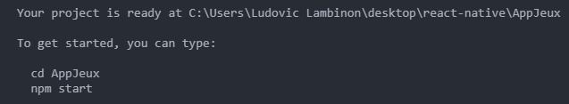

# React Native


### React Native c'est quoi ? 
React Native est un framework d'applications mobiles open source créé par Facebook. Il est utilisé pour développer des applications pour Android, iOS et UWP (Universal Windows Platform) en permettant aux développeurs d’utiliser React avec les fonctionnalitées native de ces plateformes. 

La première version de React Native est sortie en 2015.

### Principe de fonctionnement
Les principes de fonctionnement de React Native sont pratiquement identiques à ceux de React. La différence est qu'il s'exécute en tâche de fond et interprète le code JavaScript directement sur le terminal.

### Ce que nous allons réaliser
Grâce à ce Workshop nous allons réaliser une application permettant de rechercher des jeux-vidéos depuis une API.

## Pré-requis
Avant d'installer React Native, nous aurons besoin de <a href="https://nodejs.org/en/download/">Node.js</a> 

## Visualisation
Afin de voir le rendu en temps réel du projet, il existe différentes façons de faire. 

### Expo
Expo est une application mobile permettant de voir, sur smartphone ou tablette, le rendu du code écrit. Vous pouvez retrouver l'application via <a href="https://apps.apple.com/us/app/expo-client/id982107779">l'App Store</a> ou via <a href="https://play.google.com/store/apps/details?id=host.exp.exponent&hl=fr">Google Play</a>.

### Via un émulateur
Vous pouvez aussi installer un émulateur afin de développer votre application. 

L'installation étant plus longue, nous vous invitons à suivre ce <a href="https://facebook.github.io/react-native/docs/getting-started">tuto</a> en cliquant sur "React Native CLI Quickstart" une fois sur la page. 

***Pour notre workshop, nous allons utiliser une méthode différente et plus accessible***

## Installation
Pour créer notre CRNA, il faut ouvrir votre terminal et taper :
```
$ npm install -g expo-cli
```

Sur Mac, il suffit de rajouter 'sudo' avant 'npm'.

*CRNA signifie Create-React-Native-App et permet de se lancer rapidement dans le développement car elle nécessite peu de configuration. C'est le moyen le plus simple pour créer une application.*

## Création d'une CRNA
Nous voilà prêt à créer une application en React Native. 

Premièrement, dans votre terminal, il faut se placer dans le dossier où vous désirez créer votre App. 

```
$ cd \chemin_de_votre_dossier\ReactNative
```

Une fois dans votre dossier, il suffit de créer votre CRNA avec le nom de votre projet. 

```
$ expo init AppJeux
```

Dans le terminal, vous devriez avoir un message vous demandant de choisir le template que vous allez utiliser.


Appuyez sur 'Enter' une première fois et ensuite, on vous demande de réécrire le nom de l'App. Réécrivez le et appuyez à nouveau sur 'Enter'.

Une fois les différentes librairies JavaScript installées, vous verrez apparaître ce message : 


Il suffit maintenant de changer de dossier via la commande 'cd' et lancer l'App avec 'npm start'

Nous voilà prêt à coder notre App. Si tout le monde est encore OP, on se motive et on rentre dans le vif du sujet.
<a href="https://gph.is/g/4LAoNRE"></a>


<a href="react-readme/react-native-1.md">Ecrivons notre App</a>


## Le projet 
  *Nous allons essayer de faire un petit programme que nous appellerons BeCasino. Il s'agira d'un petit jeu de roulette très simplifié dans lequel vous pourrez miser une certaine somme et gagner ou perdre de l'argent :sob: ! Quand vous n'avez plus d'argent, vous avez perdu.
  * Voici les régles : 
     - Le joueur mise sur un numéro compris entre 0 et 36 (37 numéros en tout). En choisissant son numéro, il y dépose la somme qu'il souhaite miser.
     - Si le numéro gagnant est celui sur lequel le joueur a misé le croupier lui remet 36 fois la somme misée.
     - Sinon, le croupier regarde si le numéro misé par le joueur est de la même couleur que le  numéro gagnant (s'ils sont tous les deux pairs ou tous les deux impairs). Si c'est le cas, le croupier lui remet deux fois la somme misée. Sinon, le joueur perd sa mise.


## Lancer Python
    
### Sous windows

Vous avez plusieurs façons d'accéder à la ligne de commande Python, la plus évidente consistant à passer par les menus.

    Démarrer>Tous les programmes>Python 3.x>Python (Command Line).


### Sous Linux

Lorsque vous l'avez installé sur votre système, Python a créé un lien vers l'interpréteur sous la forme python3.X (le X étant le numéro de la version installée).

    Si, par exemple, vous avez installé Python 3.4, vous pouvez y accéder grâce à la commande :


## Premiers pas avec l'interpréteur de commandes Python

### Opération courante 


## Les variables 
En Python, pour donner une valeur à une variable, il suffit d'écrire. 

    nom_de_la_variable = valeur.

SI je veux associer mon nom à une variable la syntaxe sera donc :

### Première utilisation des fonctions
#### La fonction « type »
Permet de savoir de quel type est uen variable


#### La fonction print
 permet d'afficher n'importe quel nombre de valeurs fournies en arguments (c'est-à-dire entre les parenthèses). 
 

### Notre projet
Repassons maintenant à notre projet (Becasino), nous allons commencer par créer un dossier qu'on appellera "Becasino" , ensuite ouvrez ce dossier avec votre éditeur de texte , et créer y le fichier index.py
    Déclares y les variables de départ: 

- argent = Le montant qu'on a en arrivant à la roulette , on va dire 500
- continuer = True , reste vrai tant qu'on doit continuer la partie
- Rajouter une fonction qui nous indiquera notre somme de départ

 <a href="base_python/python2.md">NEXT >> </a>
