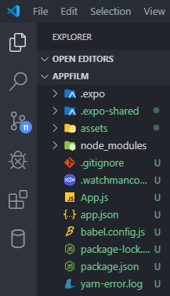

## Contenu
Tout d'abord, lorsque nous lançons la commande 'npm start', deux choses se produisent à l'écran :

### Sur le navigateur
La première, c'est l'ouverture d'une fenêtre dans notre navigateur contenant ceci : 

A gauche, un **code QR** vous permettant de vous connecter à votre App via smartphone / tablette. 
A droite, la partie **info** qui reprend les erreurs que vous pourriez rencontrer lors du développement.

### Sur le terminal
La deuxième, c'est l'apparition, dans le terminal, des différentes commandes.

Ce qui va nous intéresser ici, c'est la partie du terminal. En effet, nous allons utiliser le navigateur web pour visualiser l'application. Pour ce faire, il suffit d'appuyer sur **?** sur votre clavier. De nouvelles commandes apparaissent sur l'écran dont celle qui nous intéresse le plus : ***w*** *to run on web*

Si tout s'est bien passé, vous devriez avoir une nouvelle page dans votre navigateur web avec le message suivant : *Open up App.js to start working on your app!*

### Et dans le dossier ? 
Maintenant que tout est prêt, ouvrez le dossier de votre App dans l'explorer de VS Code et vous devriez voir ceci :

**babel.config.js** est un compilateur JS. Il permet d'écrire du JS avec une syntaxe plus simple, plus moderne et compatible avec les anciennes normes JS. 

**watchmanconfig** est un service permettant d'observer notre projet. Il va regarder et notifier chaque changement dans votre projet. 

**node_modules** est un dossier qui reprend toutes les dépendances pour que votre App fonctionne. Vous retrouverez dedans les différentes librairies. ***Il ne faut jamais toucher à ce dossier et/ou un fichier contenu dedans***.

**App.js** sera votre 'index.html' :wink: :+1:

<a href="/react-native-2.md">Bon, on va coder oui ou non ?</a>