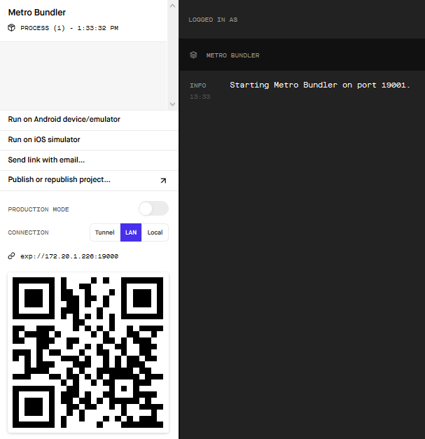

## Contenu
Tout d'abord, lorsque nous lançons la commande 'npm start', deux choses se produisent à l'écran :

### Sur le navigateur
La première, c'est l'ouverture d'une fenêtre dans notre navigateur contenant ceci : 

A gauche, un **code QR** vous permettant de vous connecter à votre App via smartphone / tablette. 
A droite, la partie **info** qui reprend les erreurs que vous pourriez rencontrer lors du développement.

### Sur le terminal
La deuxième, c'est l'apparition, dans le terminal, des différentes commandes.
