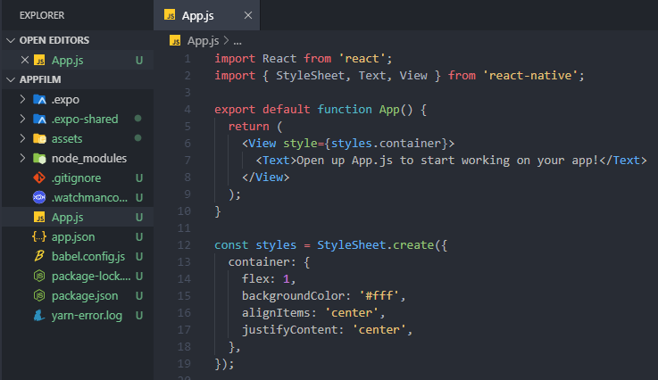
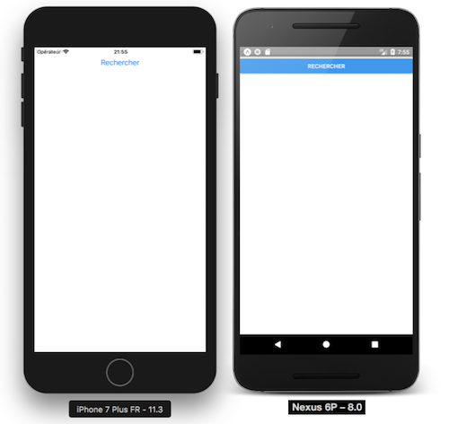

## Les components

On va commencer doucement, en ouvrant simplement votre fichier **App.js**  

  

Sur ce fichier, vous pouvez observer, dans la partie **import** et à travers les lignes de code, les termes **StyleSheet**, **Text**, **View**. Ce sont vos éléments graphiques. Il existe d'autres de ces éléments comme les vues, les boutons, images, listes, ... Cette notion de *component* est pratique car elle permet de "découper" les différentes interfaces utilisateur en pièces indépendantes et réutilisables.  

<a href="https://facebook.github.io/react-native/docs/components-and-apis.html#basic-components">Vous pouvez retrouver une liste de ces components ici.</a>  

## Créer un component custom

Histoire de commencer sur de bonnes bases, la première chose à faire est de supprimer le contenu de votre **App.js**.  

A la racine du projet, nous allons créer un dossier *Components* et un fichier *Search.js* à l'intérieur de ce dossier (les majuscules sont importantes).

Dans *Search.js*, nous allons écrire ce bout de code :  

```javascript
// Components/Search.js
import React from 'react'
import { View, TextInput, Button } from 'react-native'

class Search extends React.Component {
    render() {
        return (
            // Ici on rend à l'écran les éléments graphiques de notre component custom Search
        )
    }
}

```  

Comme vous pouvez le constater, la deuxième ligne *import* est grisée. Pourquoi ? Car nos components ne sont pas encore définis dans notre *render*. Dans notre *return*, entre parenthèses, il faut ajouter : 

```javascript
// Components/Search.js
      <View>
        <TextInput placeholder='Titre du film'/>
        <Button title='Rechercher' onPress={() => {}}/>
      </View>
```

Une fois cela fait, il nous suffit de rajouter **export default Search** à la fin du fichier *Search.js*.  

Prochaine étape, importer notre component dans notre fichier *App.js*. Mais si, vous savez, notre 'index.html', notre page princiaple de l'application.  

```javascript
// App.js
import React from 'react'
import Search from './Components/Search'

export default class App extends React.Component {
  render() {
    return (
      <Search/>
    )
  }
}
```  

Vous devriez avoir ceci comme rendu :  

  

## JSX

**JSX** est une extension du langage Javascript créée par Facebook. Il facilite la création de components avec une syntaxe très simple inspirée de **HTML** et **XML**. Par exemple, lorsque nous écrivons en JSX :  

```javascript
<View>
    <TextInput placeholder="Titre du film"/>
    <Button title="Rechercher" onPress={() => {}}/>
</View>
```  

**JSX** le convertit pour React comme ceci :  

```javascript
React.createElement(View, {},
  	React.createElement(TextInput, {placeholder: "Titre du film"}),
    React.createElement(Button, {title: "Rechercher", onPress: () => {}})
)
```  


<a href="./react-native-3.md">Un peu de style ?</a>