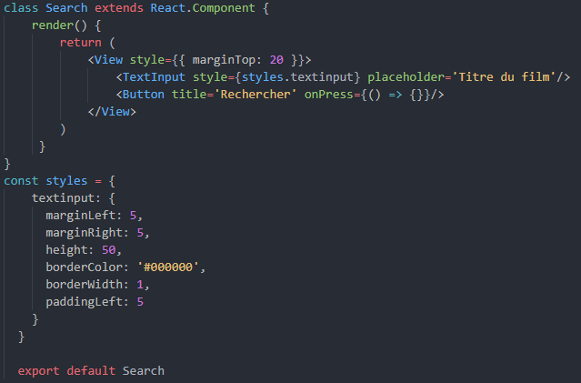

## StyleSheet
Je ne fais pas d'introduction au CSS, vous savez comment ça fonctionne. :wink:  

On attaque directement avec le *Search.js* dans lequel on va rajouter du style au code. Le contenu du *render* devrait ressembler à ceci :  

```javascript
// Components/Search.js
render() {
    return (
        <View style={{ marginTop: 20 }}>
            <TextInput style={{ marginLeft: 5, marginRight: 5, height: 50, borderColor: '#000000', borderWidth: 1, paddingLeft: 5 }} placeholder='Titre du jeu'/>
            <Button title='Rechercher' onPress={() => {}}/>
        </View>
    )
 }
```  

Nous avons appliqué sur notre *View* : 
- marginTop, qui ajoute une marge en haut de 20 pixels.
- marginRight / marginLeft, qui ajoutent des marges à gauche et à droite du TextInput.
- height, qui définit une hauteur de 50 pixels pour le TextInput.
- borderWidth / borderColor, qui ajoutent une bordure noire autour du TextInput.
- paddingLeft, qui ajoute un padding à gauche afin que le placeholder et le texte saisi ne collent pas à la bordure du TextInput.  

Vous pouvez retrouver la liste des styles pour les components React Native sur <a href="https://github.com/vhpoet/react-native-styling-cheat-sheet">ce repo</a>.  

***Faites attention que vous ne pouvez pas ajouter une propriété de style sur un component custom. On ne peut les appliquer que sur les components React Native. Par exemple, si vous voulez appliquer un backgroundColor sur la barre de recherche, vous ne pourrez pas le faire sur votre Search mais sur le View.***  


C'est sympa, non ? Ben en fait, non !  

Si on continue comme ça, on va vite rendre notre code **illisible**, et ce n'est pas notre but ! Il faut donc... 

## Externaliser ses styles
Pour externaliser les styles, il suffit de créer une constante **styles** en bas de notre fichier Javascript dans *Search.js*. On reprend donc les styles précédents et on les place dans notre constante. Ce qui donne ceci :  
```javascript
const styles = {
  textinput: {
    marginLeft: 5,
    marginRight: 5,
    height: 50,
    borderColor: '#000000',
    borderWidth: 1,
    paddingLeft: 5
  }
}
```

Et les styles dans le TextInput on en fait quoi ? On les supprime et on écrit : 
```javascript
<TextInput style={styles.textinput} placeholder='Titre du jeu'/>
```
Simple, efficace. Voilà le résultat final :  

  

*En plus d'avoir un code lisible, on peut, tout comme en CSS, réutiliser le style sur un autre component.*  

## Et si on veut créer d'autres styles ?
Alors là, deux solutions : 
- On crée un nouveau style de la même manière que précédemment. Par exemple, on crée un *textinput2*. 
- On fait un mix de notre premier style et on rajoute un autre style directement dans le *component* comme ceci :  
```javascript
<TextInput style={[styles.textinput, { marginBottom: 10 }]} placeholder='Titre du jeu'/>
```  

## StyleSheet
Vous suivez encore ? Si oui, je vous présente **StyleSheet**.  

*StyleSheet* est une API React Native permettant d'augmenter les performances des styles de votre application.  

- Sans StyleSheet, à chaque fois que votre application appelle un style, un nouvel objet avec votre style est créé. 
- Avec StyleSheet, votre style est associé à un identifiant. Chaque fois que votre application appelle votre style, StyleSheet utilise l'identifiant pour récupérer l'objet avec votre style.  

Ce n'est pas obligatoire de l'utiliser mais c'est toujours mieux. Donc, première étape, on l'importe.  
On se rend donc dans *Search.js*, *import* et on l'ajoute : 
```javascript
// Components/Search.js

import { StyleSheet, View, TextInput, Button } from 'react-native'
```  
Ensuite, toujours dans *Search.js*, on modifie notre *const styles* comme ceci :  
```javascript
// Components/Search.js

const styles = StyleSheet.create({
  textinput: {
    marginLeft: 5,
    marginRight: 5,
    height: 50,
    borderColor: '#000000',
    borderWidth: 1,
    paddingLeft: 5
  }
})
```  

Nous voilà avec une App plus performante. Là, on ne verra pas vraiment la différence mais pour de grosses applications, ce sera visible. A vous de modifier vos styles afin d'y voir plus clair.  

  

<a href="./react-native-4.md">Allons voir les Props</a>